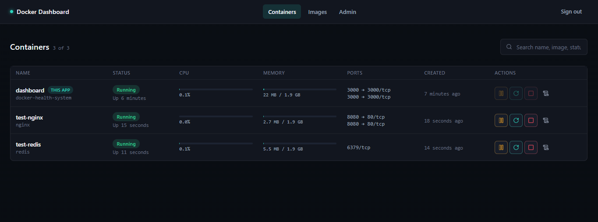
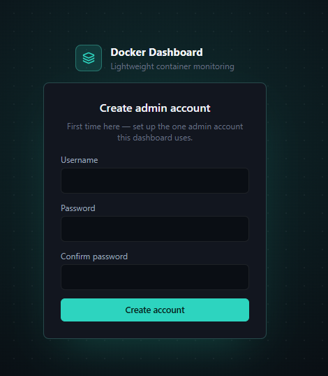
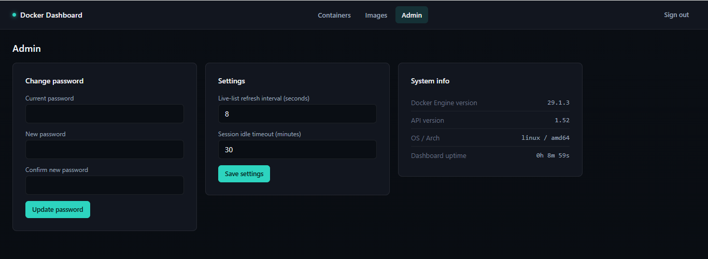
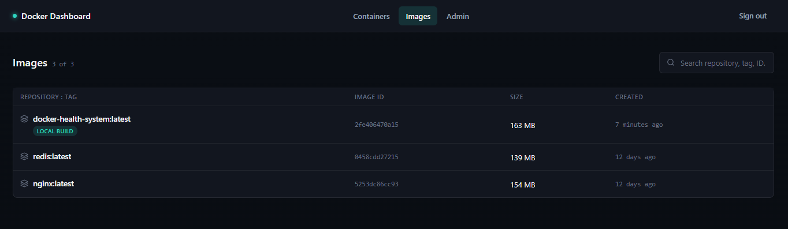
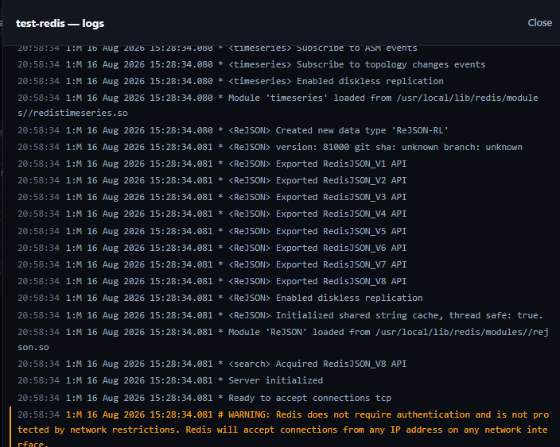

# Docker Dashboard

A lightweight, self-hosted web dashboard for monitoring and managing local Docker containers.



## Quick start

The fastest way to run it — just Docker installed, one command, nothing to configure. Every setting has a safe default, and the admin account is created through the first-run screen in your browser, not a config file.

```bash
# Port 3000 already in use (e.g. Grafana, another dev server)? Change the
# host-side number in -p, e.g. -p 3001:3000, then use that port below instead.
docker run -d --name dashboard \
  -p 3000:3000 \
  --user root \
  -v /var/run/docker.sock:/var/run/docker.sock \
  -v dashboard-data:/app/data \
  rajatindia/docker-health-system:latest
```

*(`--user root` is required, not optional — the Docker socket is root-owned on virtually every host, and the container can't reach it otherwise.)*

**Windows PowerShell users:** paste the command as a single line below, since PowerShell doesn't support `\` for line continuation the way bash does. (Same port-conflict note applies — swap `3000:3000` for e.g. `3001:3000` if needed.)

```powershell
docker run -d --name dashboard -p 3000:3000 --user root -v /var/run/docker.sock:/var/run/docker.sock -v dashboard-data:/app/data rajatindia/docker-health-system:latest
```

Prefer Compose? Same thing, referencing the published image directly (no cloning, no build):

```yaml
services:
  dashboard:
    image: rajatindia/docker-health-system:latest
    user: root
    ports:
      - "3000:3000"
    volumes:
      - /var/run/docker.sock:/var/run/docker.sock
      - dashboard-data:/app/data

volumes:
  dashboard-data:
```

```bash
docker compose up -d
```

### Build from source

For working on the code itself, rather than just running it:

```bash
git clone https://github.com/RajatGourIndia/docker-health-system.git
cd docker-health-system
cp .env.example .env
docker compose up -d
```

This uses the `docker-compose.yml` already in the repo, which builds from the local `Dockerfile` instead of pulling the published image.

### First run

Open **http://localhost:3000**. Since no admin account exists yet, you'll land on a **Create Admin Account** screen instead of a login page — pick a username and password there. Every visit after that shows the normal login screen.

## Applying .env changes

If you edit `.env` after the container is already running, `docker restart` won't pick it up — it reuses the container's original environment as-is. What actually applies the change depends on how you're running it:

- **Docker Compose**: just run `docker compose up -d` again. Compose detects that the resolved config (including everything loaded from `.env`) changed since the container was created, and recreates it automatically — no extra step needed.
- **Plain `docker run`**: use the included helper script, which does stop + remove + run with the same flags as the Quick Start command above:

  ```bash
  ./scripts/recreate.sh
  ```

  On Windows PowerShell:

  ```powershell
  .\scripts\recreate.ps1
  ```

  Both pick up a `.env` in the current directory automatically and accept overrides if you changed the container name or port, e.g. `HOST_PORT=3001 ./scripts/recreate.sh` or `.\scripts\recreate.ps1 -HostPort 3001`.

## Features

- **Containers** — live list (auto-updating via server-sent events), search/filter, pagination, per-container CPU and memory meters
- **Container actions** — Start, Stop, Restart, Pause, Resume, right from the list
- **Logs** — tail recent output or follow it live, with a one-click download
- **Images** — repository/tag, size, and creation date for everything pulled or built locally
- **Admin settings** — change the admin password, tune the live-refresh interval and session idle timeout, and view read-only system info (Docker Engine/API version, dashboard uptime)

## Screenshots

| | |
|---|---|
|  |  |
|  |  |

## Security note

**This tool is intended for local or private-network use** (localhost, a home network, or an internal company network). It has not been hardened for direct exposure to the public internet — do not expose it directly without adding your own reverse proxy, TLS, and rate-limiting.

## Password recovery

There's no email-based password reset (this is a self-hosted, single-admin tool with no SMTP setup). If you forget the password, run this from the host:

```bash
docker exec -it dashboard npm run reset-admin-password
```

It'll prompt for a new password right in the terminal. (Replace `dashboard` with your container's actual name if you changed it.)

## License

[MIT](./LICENSE)
